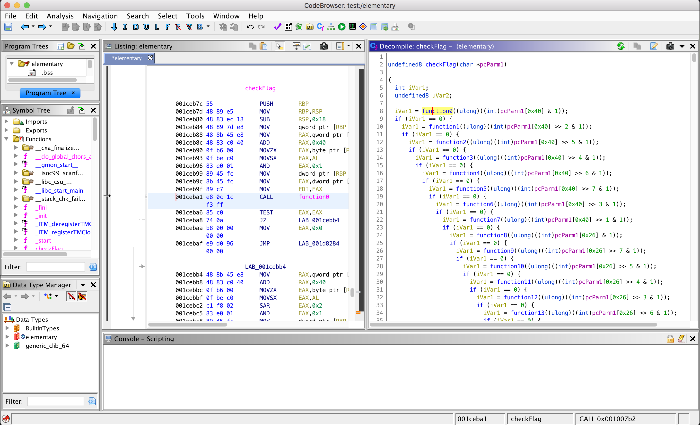

# Elementary
RE

## Challenge 

Elementary, my dear Watson.

elementary

## Solution

Decompile in Ghidra Decompiler

    undefined8 main(void){
      // ...
      printf("Password: ");
      __isoc99_scanf(&DAT_001d831f,local_98);
      iVar1 = checkFlag(local_98);
      if (iVar1 == 0) {
        printf("Wrong!");
      }
      else {
        printf("Good job!");
      }
      // ...
    }

We see that it does a checkFlag() of our input flag...

When decompiling checkFlag, we see that it does some checks of `function0` through `function831()`.

I copied out the code into a text file

> [decompiled_checkFlag.c](decompiled_checkFlag.c)

Using a script, I cleaned up the code to output all the function checks. Notice all functions deal with one bit as seen by the `&1`.

    0 iVar1=function0((ulong)((int)pcParm1[0x40]&1));
    1 iVar1=function1((ulong)((int)pcParm1[0x40]>>2&1));
    2 iVar1=function2((ulong)((int)pcParm1[0x40]>>5&1));
    3 iVar1=function3((ulong)((int)pcParm1[0x40]>>4&1));
    4 iVar1=function4((ulong)((int)pcParm1[0x40]>>6&1));
    5 iVar1=function5((ulong)((int)pcParm1[0x40]>>7&1));
    6 iVar1=function6((ulong)((int)pcParm1[0x40]>>3&1));
    7 iVar1=function7((ulong)((int)pcParm1[0x40]>>1&1));
    8 iVar1=function8((ulong)((int)pcParm1[0x26]&1));
    9 iVar1=function9((ulong)((int)pcParm1[0x26]>>7&1));

For each function call:
- There is an index in square brackets `[]` for the char array `pcParm1`.
- There is a bit shift.

I will extract these info in the script.

---

Now the functions return value will either flip the result `function98` or return the bit as it is `function97`.

    ulong function98(uint uParm1){
      return (ulong)(uParm1 ^ 1);
    }

    ulong function97(uint uParm1){
      return (ulong)uParm1;
    }

This corresponds to the ASCII binary of the flag.

It is too slow to decompile one by one, hence I created a GDB script to retrieve the results

> [solve-gdb_extract.py](solve-gdb_extract.py)

Then the script will output a dictionary of the function return values for me to use.

    # python gdb_extract.py 
    gdb_dict = {0:1,1:1,2:1,3:0,4:1,5: ...

Then we have necessary info (index, bit shift, return value).

    $ python3 solve-flag.py
    0 iVar1=function0((ulong)((int)pcParm1[0x40]&1));
    1 iVar1=function1((ulong)((int)pcParm1[0x40]>>2&1));
    ...
    830 iVar1=function830((ulong)((int)pcParm1[0x14]>>2&1)); 20 2 830
    831 iVar1=function831((ulong)((int)pcParm1[0x14]>>4&1)); 20 4 831
    p4{I_really_hope_you_automated_this_somehow_otherwise_it_might_be_a_bit_frustrating_to_do_this_manually}

## Flag

    p4{I_really_hope_you_automated_this_somehow_otherwise_it_might_be_a_bit_frustrating_to_do_this_manually}
